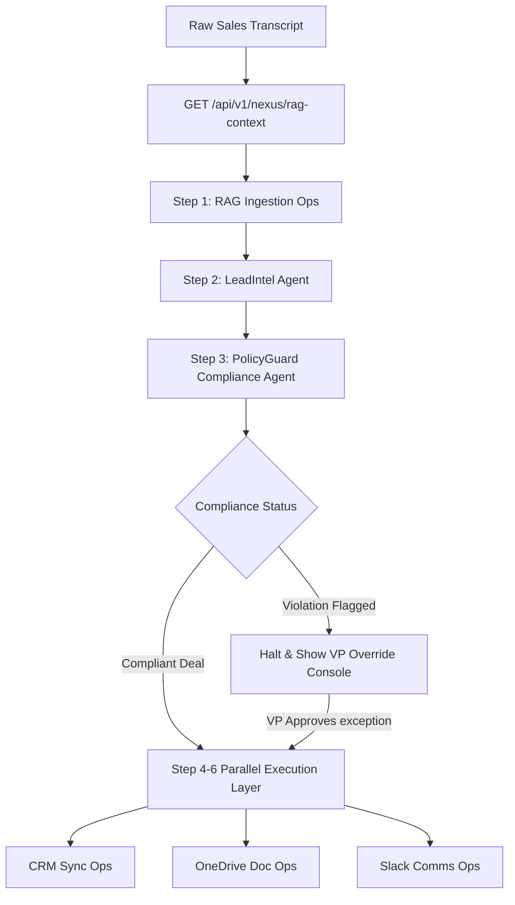

# 🚀 Aegis Nexus — Autopilot Revenue Command Center

Welcome to **Aegis Nexus**, the next-generation multi-agent revenue command center. Aegis Nexus automates the entire B2B sales lifecycle—from raw meeting transcript analysis and CRM registration to compliance auditing, custom proposal generation, and real-time revenue team notifications—while keeping **Humans-in-the-Loop** for margin governance and exception overrides.

This repository is built using **FastAPI (Python)**, **Next.js 15 (React 19)**, **SQLite/PostgreSQL**, and is fully containerized with **Docker Compose**.

---

## 🎯 Double-Sided Operation Manual
This guide is structured into two comprehensive sections to serve both our engineering team and our executive leadership:

1. [🛠️ PART 1: THE ENGINEERING DEVELOPER MANUAL](#-part-1-the-engineering-developer-manual) (For Developers & Architects)
2. [📈 PART 2: THE EXECUTIVE REVENUE PLAYBOOK](#-part-2-the-executive-revenue-playbook) (For Sales VPs & Operations Leaders)

---

# 🛠️ PART 1: THE ENGINEERING DEVELOPER MANUAL

## 🧬 Architectural Overview & Data Flow
Aegis Nexus employs an **Interactive Client-Side Orchestrator (AgentMesh)** that coordinates six specialized Supervity agent workflows. Unlike standard black-box AI engines, Aegis Nexus breaks down execution into isolated steps, facilitating granular error boundary handling and real-time data tracing.



---

## 🎛️ Downstream Agent Payload Definitions
The backend proxy executes direct client requests via `POST /api/v1/nexus/workflows/execute` using standard `multipart/form-data` parameters:

### 1. Ingestion / Policy Lookup (`ingestion`)
* **Endpoint**: `GET /api/v1/nexus/rag-context`
* **Purpose**: Retrieves cached discount caps, restricted competitors, and SLA commitments from SQLite.
* **Output Example**:
  ```json
  {
    "status": "success",
    "policy_config": {
      "max_allowable_discount": 35.0,
      "restricted_competitors": ["Acrobatics Corp", "OmniGuard Inc"]
    }
  }
  ```

### 2. Lead Intel Agent (`LEAD_INTEL`)
* **Supervity Workflow ID**: `019e3095-3378-7000-81f1-6f5dfee4b6ea`
* **Form Inputs**: 
  - `workflowId`: `"LEAD_INTEL"`
  - `inputs[sales_transcript]`: Raw text.
  - `inputs[knowledge_ingestion_output]`: Active ingested policies.
* **Output Schema**:
  ```json
  {
    "intent_score": 85,
    "prospect": { "name": "Sarah Kim", "company": "TechFlow Solutions" },
    "battlecard": { "pain_points": ["latency"], "strategy": "Focus on SLAs" }
  }
  ```

### 3. Policy Guard Compliance Agent (`POLICY_GUARD`)
* **Supervity Workflow ID**: `019e306a-34a6-7000-ab83-01ed37ef91a4`
* **Form Inputs**: 
  - `workflowId`: `"POLICY_GUARD"`
  - `inputs[sales_transcript]`: Raw text.
  - `inputs[extracted_data]`: JSON stringified output from `LEAD_INTEL`.
* **Output Schema**:
  ```json
  {
    "compliant": false,
    "violations": [{ "rule": "Discount exceeds 35% cap", "severity": "CRITICAL" }],
    "recommendation": "Halt deal pending VP Approval."
  }
  ```

### 4. Zoho CRM Sync Ops (`CRM_OPS`)
* **Supervity Workflow ID**: `019e307e-2f53-7000-a9c8-25ae89119cf9`
* **Form Inputs**:
  - `inputs[runId]`: Target pipeline execution ID.
  - `inputs[lead_intel]`: Stringified JSON from `LEAD_INTEL`.
* **Output Schema**: `{ "status": "success", "crm_deal_id": "DEAL-99831", "lead_status": "registered" }`

### 5. OneDrive Doc Ops (`DOC_OPS`)
* **Supervity Workflow ID**: `019e3089-2ae9-7000-90c5-f6e1e1269002`
* **Form Inputs**: `inputs[transcript]`: Raw text.
* **Output Schema**: `{ "status": "success", "share_link": "https://onedrive.live.com/proposal_TechFlow" }`

### 6. Slack Comms Ops (`COMMS_OPS`)
* **Supervity Workflow ID**: `019e308d-dd05-7000-b8ae-2035b6e5b65c`
* **Form Inputs**: `inputs[runId]`: Pipeline execution ID.
* **Output Schema**: `{ "status": "success", "slack_sent": true }`

---

## 💻 Tech Stack & Deployment Guide

| Component | Technology | Description |
|-----------|------------|-------------|
| **Backend API** | Python 3.11 + FastAPI + Gunicorn | Core API services and proxy coordination |
| **Frontend Web** | Next.js 15 + React 19 + TailwindCSS | Premium VP Dashboard & interactive AgentMesh |
| **Database ORM** | SQLite / PostgreSQL + SQLAlchemy + Alembic | Persistent schema migrations & audit logging |
| **Containers** | Docker + Docker Compose | Development & staging isolation |

### Getting Started (Locally)
1. **Prepare Environment Settings**:
   ```bash
   cp .env.example .env
   ```
2. **Build and Spin Up Containers**:
   ```bash
   docker-compose up --build -d
   ```
3. **Database Setup & Seed Data**:
   ```bash
   # Reset local tables and populate seed records
   docker-compose exec backend python scripts/reset_db.py
   docker-compose exec backend python scripts/seed_db.py
   ```
4. **Access Panels**:
   - **Frontend UI**: `http://localhost:3001`
   - **Swagger Docs**: `http://localhost:8001/api/docs`

---

## 🧑‍💻 Developer Verification & Diagnostics

### Viewing Logs
To stream backend and container operations live:
```bash
docker compose logs -f backend
```

### TypeScript Validation & Build Compilation
To run a production TypeScript type-check dry run:
```bash
cd frontend
npm run build
```

> [!NOTE]
> The backend handles client connection timeouts resiliently by employing a `120.0` seconds gateway timeout in `app/services/supervity.py`, preventing slow Claude inference models from aborting prematurely.

---

# 📈 PART 2: THE EXECUTIVE REVENUE PLAYBOOK

## 👑 Strategic Overview: The Aegis Advantage
In enterprise B2B sales, speed and compliance are often at war. Account Executives offer deep discounts to close deals quickly, resulting in profit margins leaking out of the pipeline. Meanwhile, manually copying data into CRM systems, generating enterprise proposals, and updating team Slack channels slows deal momentum.

**Aegis Nexus solves this.** 
Aegis Nexus acts as a transparent, automated operational partner. It ingests your raw Zoom call transcripts and instantly:
* Parses customer pain points, BANT criteria, and prospect details.
* Automatically registers lead details in your **Zoho CRM**.
* Drafts a custom enterprise proposal inside **Microsoft OneDrive** matching corporate standards.
* Notifies your entire revenue team inside **Slack** of updates.
* **Critically**: Evaluates every deal against active corporate policies to ensure zero profit leakage.

---

## 🔮 The AgentMesh Dashboard: Transcending the Black Box
Traditional AI assistants operate as a "black box" where you submit an input and hope the output is correct. Aegis Nexus introduces the **Supervity Interactive AgentMesh**—a visual, live-tracing console tailored for business leadership.

* **Live Status Traces**: Watch the deal move through ingestion, parsing, margin checks, CRM syncing, document creation, and Slack notification in real time.
* **Micro-Timers**: Instantly view how long each model execution took, ensuring full operational transparency.
* **Data Trace Inspections**: With one click on `Inspect Data Trace`, you can view the exact underlying raw payloads, prompts, and JSON outputs parsed by our AI models.

---

## 🚦 Human-in-the-Loop Guardrails: Compliance & Governance

Aegis Nexus protects your margins from unauthorized discounting without halting business operations. When a salesperson offers a discount exceeding your preset threshold (e.g. 35%), the system springs into action:

1. **Pipeline Halt**: The automated sync to Zoho CRM, OneDrive, and Slack is immediately paused at the **PolicyGuard Agent** stage.
2. **VP Notification**: A prominent alert warns of critical compliance violations.
3. **VP Override Panel**: A popup tailored for VP Sarah Jenkins prompts you to review the deal.
4. **Approval & Resume**: You can type your strategic approval reason (e.g., *"Approved. Premium tier contract locked for 36 months to offset the discount"*), click approve, and the pipeline immediately dispatches all downstream actions!
5. **Permanent Audit Log**: This override is securely saved in the SQLite compliance ledger for executive audit compliance.

---

## 📝 Managing Strategic Rules in the AI Policies Tab
As market conditions change, your discount thresholds must adapt. Aegis Nexus enables you to adjust these policies dynamically:

1. Navigate to the **AI Policies** tab in the sidebar navigation.
2. View your active policies, including discount margin limits, restricted competitors, and SLA requirements.
3. Edit or upload a new markdown `DESIGN.md` configuration file.
4. Click **Update Policies** to apply the new rules instantly across the RAG ingestion pipeline, instantly updating the guardrails for future sales evaluations.

---

## 🌟 The Business ROI
* **95% Reduction in Administrative Overhead**: Deal registration, document drafting, and communications occur in parallel in seconds.
* **100% Margin Governance**: No unapproved discounts or restricted terms bypass our compliance gate.
* **Unprecedented Pipeline Speed**: What took days of back-and-forth approval loops now takes seconds with a simple compliance override.
